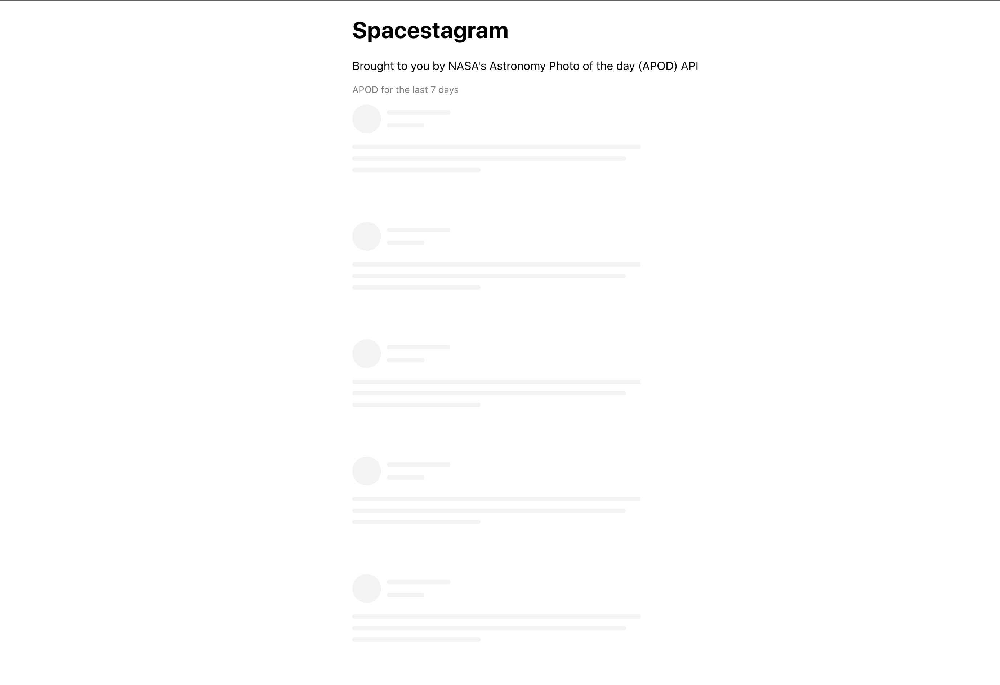
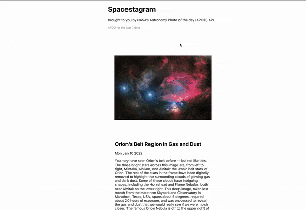
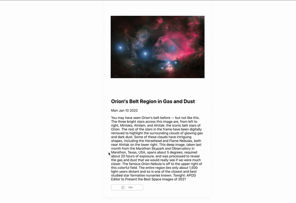
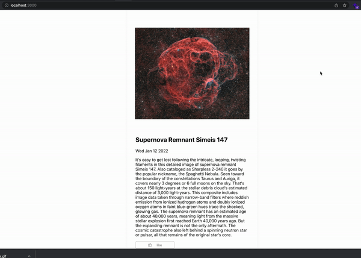
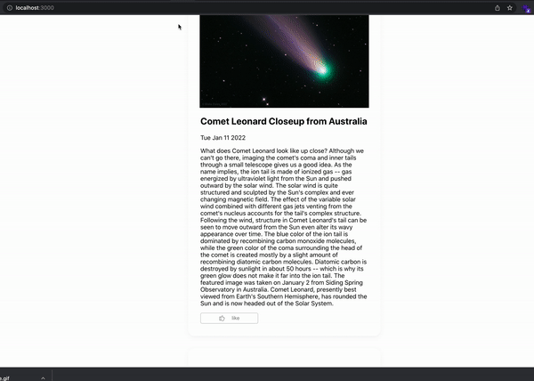

# Spacetagram - Using NASA's APOD API

This is a mini-project that uses the [NASA's Astronomy Photo of the day (APOD) API](https://api.nasa.gov/) to show the APOD for the last 7 days.
The app using React, Redux for state management, React hooks, localstorage for persisting data and other helper libraries

## Feature
- The app can get the NASA APOD for the last 7 days
- User can like a picture
- The app saves the user likes and even persists even after reload of the page
- The app uses the right HTML5 elements to support accessibility
- Easy loading of the images. It uses that placeholder that blurs in as the actual image loads
- While waiting for the data it shows a skeleton loader
- Normalizes data before storing in state

## Live URL

The project has been host on Netlify at [Spacetagram](https://apodsnasa.netlify.app/)

## How to run the Program on Your Computer

You’ll need to have Node >= 8.10 on your local development machine (but it’s not required on the server). You can use [nvm](https://github.com/creationix/nvm#installation) (macOS/Linux) or [nvm-windows](https://github.com/coreybutler/nvm-windows#node-version-manager-nvm-for-windows) to switch Node versions between different projects.

Locate the path of the project and install the dependencies with the command below

```
git clone https://github.com/kwabena53/NasaChallenge.git
npm install or yarn install
```

Run the following command to start the app on your local service http://localhost:3000/

```
npm start or yarn start
```

## Security
- The app does not expose the API URL and the API keys
- It uses environment variables on the server (Netlify)
- Uses gitignore to prevent pushing delicate information to GitHub


## Screenshots

### `Loading Screen`
The app shows a skeleton loading view while waiting to get data from the API

 

### `Display APODs`
The app will display all the APODs for the last 7 days. Showing their title, date of capture and description



### `Like and Unlike`
The use should be able to like and unlike a picture as many times as they want.



### `Easy Load`
There is an easy loading feature for all images that are loaded for display. There is a placeholder and it blurs out to display the actual image



### `Saved Likes`
The app pesists data. This means that when you like and image, it is saved and even when you reload the page it is not refreshed

